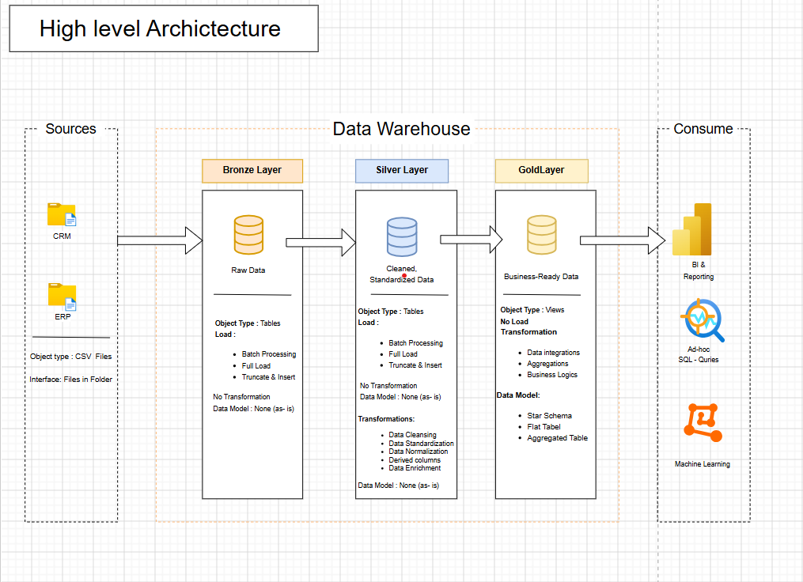

<h1 style="font-size: 56px;"> Data Warehouse and Analytics Project</h1>
Welcome to the Data Warehouse and Analytics Project repository! 🚀

This project demonstrates a comprehensive data warehousing and analytics solution, from building a data warehouse to generating actionable insights. Designed as a portfolio project, it highlights industry best practices in data engineering and analytics.

<h1 style="font-size: 56px;"> 🏗️ Data Architecture</h1>

The data architecture for this project follows Medallion Architecture Bronze, Silver, and Gold layers:

1. Bronze Layer: Stores raw data as-is from the source systems. Data is ingested from CSV Files into SQL Server Database.
2. Silver Layer: This layer includes data cleansing, standardization, and normalization processes to prepare data for analysis.
3. Gold Layer: Houses business-ready data modeled into a star schema required for reporting and analytics.

<h1 style="font-size: 56px;">📖 Project Overview</h1>
This project involves:

1. Data Architecture: Designing a Modern Data Warehouse Using Medallion Architecture Bronze, Silver, and Gold layers.
2. ETL Pipelines: Extracting, transforming, and loading data from source systems into the warehouse.
3. Data Modeling: Developing fact and dimension tables optimized for analytical queries.
4. Analytics & Reporting: Creating SQL-based reports and dashboards for actionable insights.
   
🎯 This repository is an excellent resource for professionals and students looking to showcase expertise in:

<ul style="font-size: 18px;">
  <li>SQL Development</li>
  <li>Data Architect</li>
  <li>Data Engineering</li>
  <li>ETL Pipeline Developer</li>
  <li>Data Modeling</li>
  <li>Data Analytics</li>
</ul>

<h1 style="font-size: 56px;">📖 Project Requirements</h1> 
<h2 style="font-size: 56px;">Building the Data Warehouse (Data Engineering)</h2> 

Objective

Develop a modern data warehouse using SQL Server to consolidate sales data, enabling analytical reporting and informed decision-making.

Specifications

<ul style="font-size: 18px;">
  <li>Data Sources: Import data from two source systems (ERP and CRM) provided as CSV files.</li></li>
  <li>Data Quality: Cleanse and resolve data quality issues prior to analysis.</li>
  <li>Integration: Combine both sources into a single, user-friendly data model designed for analytical queries.</li></li>
  <li>Scope: Focus on the latest dataset only; historization of data is not required.r</li>
  <li>Documentation: Provide clear documentation of the data model to support both business stakeholders and analytics teams.</li>
</ul>

<h1 style="font-size: 56px;">🌟 About Me </h1> 
Hi there! I'm Prabhakar Pillangari. I’m an IT professional.

